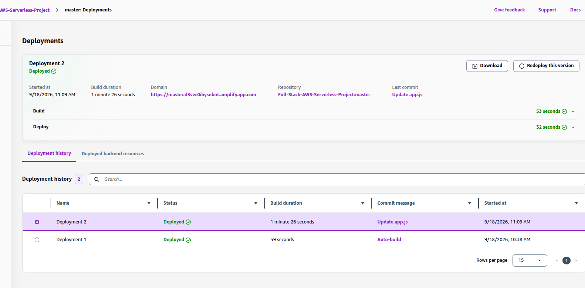
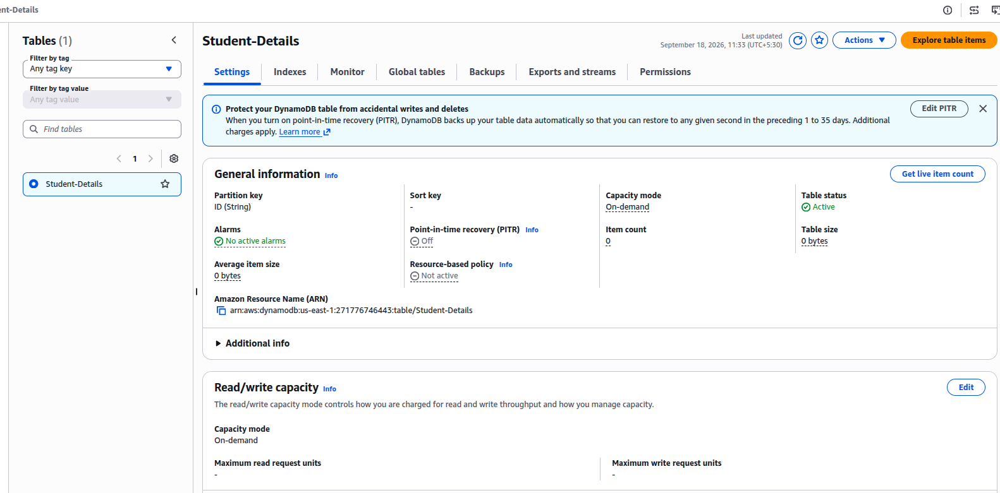
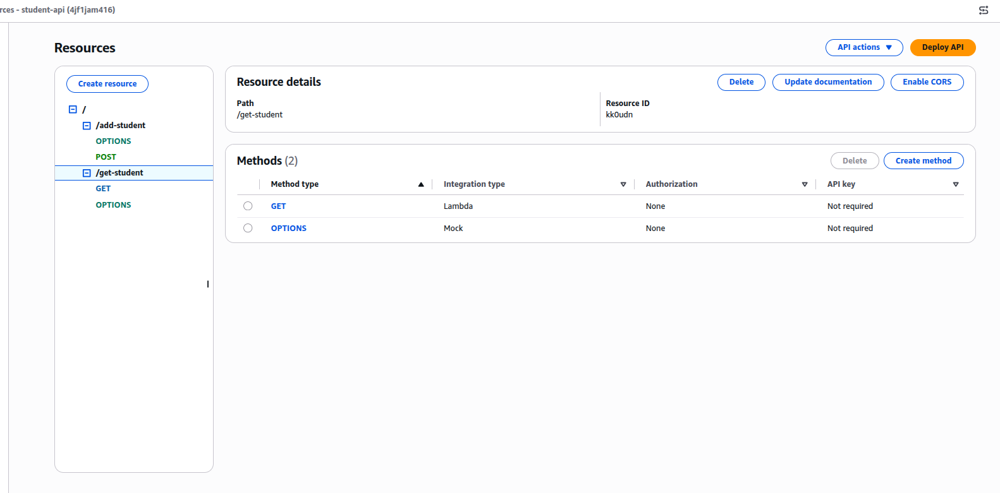

# Awesome App

A modern, scalable, serverless application demonstrating the integration of frontend and backend components on AWS. Built with **AWS Amplify**, **Lambda**, **DynamoDB**, and **API Gateway** for a hassle-free deployment experience.

## Features

- **Serverless Deployment** — scalable, cost-effective infrastructure with no servers to manage
- **Full Stack** — HTML/CSS/JS frontend seamlessly integrated with a Python backend
- **NoSQL Database** — DynamoDB for fast, flexible, schema-less data storage

## Architecture

```
Browser (Amplify-hosted frontend: AWS-Serverless-Project)
      │
      ▼
API Gateway — student-api
      │            │
      ▼            ▼
add-student    get-student   (Lambda, Python 3.12)
      │            │
      ▼            ▼
   DynamoDB — Student-Details
```

## Project Structure

```
├── Backend/
│   └── DynamoDB-Policy         # IAM policy JSON for DynamoDB access
├── Frontend/
│   ├── css/
│   ├── images/
│   ├── js/
│   │   └── app.js
│   ├── index.html
│   ├── manifest.json
│   └── sw.js
├── assets/
│   ├── amplify-deployment.png
│   ├── dynamodb-table.png
│   └── api-gateway-resources.png
├── .gitignore
├── LICENSE
└── README.md
```

## Prerequisites

- An AWS account with access to the AWS Management Console
- A GitHub (or other git provider) account with this repository pushed to it, for connecting to Amplify Hosting
- Basic familiarity with the AWS Console navigation (DynamoDB, IAM, Lambda, API Gateway, Amplify)

## Deployment Steps

### 1. Create the Amplify app and connect the repository

1. Open the **AWS Amplify Console** → **New app** → **Host web app**.
2. Choose your git provider (this project uses GitHub) and authorize Amplify to access your account.
3. Select the repository **Full-Stack-AWS-Serverless-Project** and branch **master**.
4. Set the app name (e.g. `AWS-Serverless-Project`) and confirm the build settings — this is a static site (no build step), so the output directory should point at `Frontend/`.
5. Choose **Save and deploy**. Amplify will run the first deployment (**Deployment 1**) and give you a live domain, e.g. `https://master.d3vec0ibysnknt.amplifyapp.com`.
6. Leave the app.js API URL as a placeholder for now — you'll update it in Step 6 once the backend exists, then Amplify will auto-build a new deployment from the commit (this project's **Deployment 2** was exactly that: an `Update app.js` commit that auto-built and deployed in about 1.5 minutes).



### 2. Create the DynamoDB table

1. Open the **DynamoDB Console** → **Tables** → **Create table**.
2. Table name: `Student-Details`.
3. Partition key: `ID`, type **String** (no sort key).
4. Capacity mode: **On-demand** (default).
5. Choose **Create table** and wait for **Table status** to show **Active**. You can confirm the table and its items any time via **Explore table items** on the table's Settings page.
6. Note the table ARN, shown under **General information**: `arn:aws:dynamodb:us-east-1:<ACCOUNT_ID>:table/Student-Details` (region: `us-east-1`).



### 3. Create the IAM role and attach the DynamoDB policy

1. Open the **IAM Console** → **Roles** → **Create role**.
2. Trusted entity type: **AWS service**. Use case: **Lambda**. Choose **Next**.
3. On the permissions step, choose **Create policy** (opens in a new tab):
   - Select the **JSON** tab and paste in the contents of `Backend/DynamoDB-Policy` (scoped to the `Student-Details` table ARN from Step 2).
   - Choose **Next**, give it a name (e.g. `StudentDetailsDynamoDBAccess`), and choose **Create policy**.
4. Back on the role creation tab, refresh the policy list, search for the policy you just created, and check it.
5. Also search for and check **AWSLambdaBasicExecutionRole** (allows the functions to write to CloudWatch Logs).
6. Choose **Next**, name the role (e.g. `AwesomeAppLambdaRole`), and choose **Create role**.

### 4. Create the Lambda functions

This project uses **two** separate Lambda functions, one per operation, both deployed as `.zip` packages on **Python 3.12** (Standard architecture):

| Function | Purpose |
|---|---|
| `add-student` | Writes a new student record to `Student-Details` |
| `get-student` | Reads student record(s) from `Student-Details` |

For each function:

1. Open the **Lambda Console** → **Create function** → **Author from scratch**.
2. Function name: `add-student` (repeat later for `get-student`). Runtime: **Python 3.12**.
3. Under **Change default execution role**, choose **Use an existing role** and select `AwesomeAppLambdaRole` from Step 3.
4. Choose **Create function**.
5. In the **Code** tab, upload the corresponding backend code as a `.zip` file (**Upload from** → **.zip file**), or paste it into the inline editor.
6. Set the **Handler** (under **Runtime settings** → **Edit**) to match your entry point.
7. Choose **Deploy** to save the function code.
8. Use the **Test** tab to invoke the function with a sample event and confirm it can read/write to `Student-Details`.

To update either function later, repeat step 5 with the new code and choose **Deploy** again.

### 5. Set up API Gateway

This project uses a single REST API named **student-api** (API ID `4jf1jam416`) with two resources, one per Lambda function:

| Resource | Methods | Integration | Auth |
|---|---|---|---|
| `/add-student` | `POST`, `OPTIONS` | Lambda (`add-student`) | None |
| `/get-student` | `GET`, `OPTIONS` | Lambda (`get-student`) | None |

To rebuild this:

1. Open the **API Gateway Console** → **Create API** → choose **REST API** (not private) → **Build**.
2. Name the API `student-api` and choose **Create API**.
3. Under **Resources**, choose **Create resource** to add `/add-student`, then again for `/get-student`.
4. For `/add-student`, choose **Create method** → **POST**:
   - Integration type: **Lambda Function**.
   - Select the `add-student` Lambda from Step 4.
5. For `/get-student`, choose **Create method** → **GET**:
   - Integration type: **Lambda Function**.
   - Select the `get-student` Lambda from Step 4.
6. Select each resource and choose **Enable CORS** — this adds the `OPTIONS` method automatically so the Amplify-hosted frontend can call the API from the browser.
7. Choose **Actions** (or **API actions**) → **Deploy API**. Create a new stage (e.g. `prod`) and deploy.
8. Note the **Invoke URL** shown at the top of the stage editor page — you'll need it in the frontend config.



### 6. Configure the frontend

In `Frontend/js/app.js`, set the API base URL to the API Gateway invoke URL from Step 5 (using the actual API ID `4jf1jam416` and whichever stage you deployed, e.g. `prod`):

```javascript
const API_BASE_URL = "https://4jf1jam416.execute-api.us-east-1.amazonaws.com/prod";
```

Commit and push this change — since the repository is already connected to Amplify (Step 1), this triggers an automatic rebuild and redeploy of the frontend.

### 7. Verify the deployment

- Open the Amplify-provided domain URL in a browser (e.g. `https://master.d3vec0ibysnknt.amplifyapp.com`).
- Confirm the app loads and that adding/retrieving a student record succeeds end-to-end (frontend → API Gateway → Lambda → DynamoDB).
- Check the **Deployment history** tab in Amplify to confirm the latest deployment (triggered by your `app.js` commit) shows **Deployed**.
- Check **CloudWatch Logs** for either Lambda function if any API calls fail.

## Environment Notes

| Component | Region | Notes |
|---|---|---|
| DynamoDB | us-east-1 | Table: `Student-Details`, partition key `ID` (String), on-demand capacity |
| Lambda | us-east-1 | Functions: `add-student`, `get-student` — Python 3.12, Zip package, Standard architecture |
| API Gateway | us-east-1 | REST API: `student-api` (ID `4jf1jam416`) — `/add-student` (POST), `/get-student` (GET), CORS enabled |
| Amplify Hosting | Global (CDN) | App: `AWS-Serverless-Project`, branch `master`, domain e.g. `https://master.d3vec0ibysnknt.amplifyapp.com` — auto-deploys on push to `master` |

## Security Considerations

- The IAM policy in `Backend/DynamoDB-Policy` is scoped to a single table ARN — keep it that way rather than widening to `*` resources.
- Enable API Gateway throttling/usage plans if the API is public.
- Consider adding **Cognito** authentication in front of API Gateway if the app handles sensitive student data.

## Teardown

To avoid ongoing charges, remove resources when no longer needed:

1. **Amplify**: Amplify Console → select `AWS-Serverless-Project` → **App settings** → **General settings** → **Delete app**.
2. **API Gateway**: API Gateway Console → select `student-api` → **Actions** → **Delete API**.
3. **Lambda**: Lambda Console → select `add-student` and `get-student` → **Actions** → **Delete function** for each.
4. **IAM role/policy**: IAM Console → **Roles** → delete `AwesomeAppLambdaRole`; **Policies** → delete `StudentDetailsDynamoDBAccess`.
5. **DynamoDB**: DynamoDB Console → select the `Student-Details` table → **Delete table**.

## License

See [LICENSE](./LICENSE) for details.
